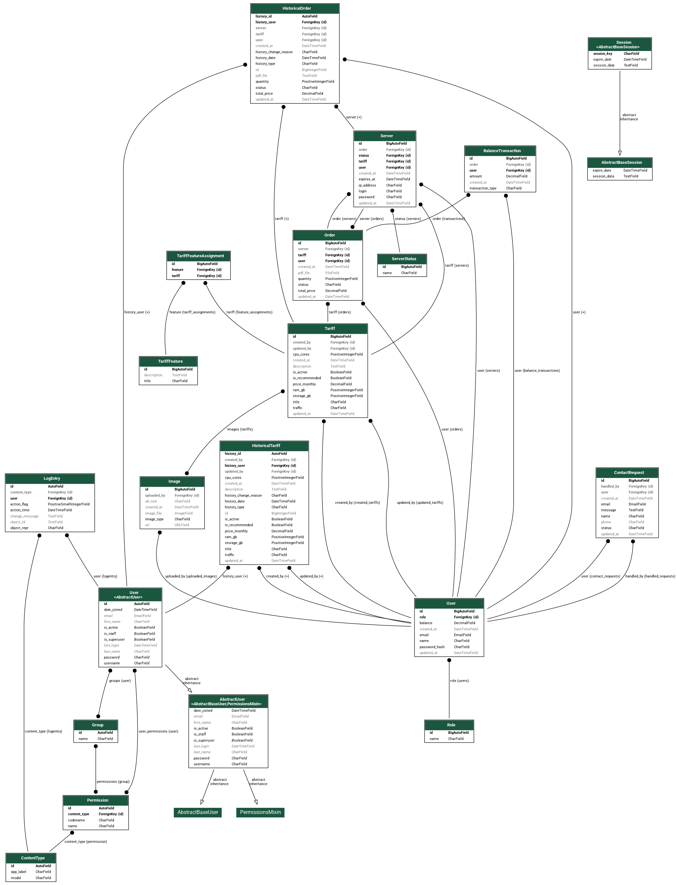

# 🖥️ Hosting Provider Platform

Full-stack web application for selling and managing virtual servers.

The project implements a user account with tariffs, a shopping cart, and orders, as well as an administrative section for managing tariffs, orders, servers, and user inquiries.

> Django + Django REST Framework backend, React + TypeScript frontend, session-based authentication, Redis/Celery background tasks.

---

## 🛠 Tech Stack

### Backend


### Frontend


### Additional tools

- Django Admin
- django-filter
- django-simple-history
- django-import-export
- ReportLab
- ESLint
- REST API
- Git / GitHub

---

## ✨ Features

### 👤 Authentication

- Registration
- Login / Logout
- Session-based authentication
- Current user endpoint
- Password hashing
- User roles

### 💻 Tariffs

- Tariff catalog
- Tariff details
- Search
- Filtering
- Sorting
- Pagination
- Tariff characteristics
- Multiple images
- Recommended tariffs
- Active/inactive tariffs
- Admin CRUD operations

### 🛒 Shopping Cart

- Add tariff to cart
- Change quantity
- Remove items
- Cart total calculation
- Session-based cart storage

### 📦 Orders

- Checkout
- Balance validation
- Balance deduction
- Transaction history
- Order history
- Order details
- Automatic server provisioning
- Order PDF generation

### 🖥️ Servers

- User server list
- Server details
- Tariff association
- Server status
- IP address
- Access credentials
- Expiration date

### 📨 Support

- Contact requests
- User request history
- Request status management
- Administrator assignment

### 🔧 Administration

- Django Admin
- Users and roles management
- Tariff management
- Orders management
- Servers management
- Balance transactions
- Support requests
- Search and filters
- Inline related objects
- Bulk PDF generation
- Import / Export
- Change history

### ⚡ Background processing

Order provisioning is performed asynchronously with Celery and Redis.

After successful checkout:

```text
Checkout
   ↓
Order creation
   ↓
Balance transaction
   ↓
Celery task
   ↓
Server provisioning
```

---

## 🏗 Architecture

The project is split into two main parts.

```text
webdev_hosting-project/
├── config/                # Django project configuration
├── hosting/               # Main business logic and models
├── rest_api/              # REST API layer
├── frontend/              # React + TypeScript frontend
├── postman/               # API collection
├── images/                # Project assets
├── db_schema.png          # Database schema
├── manage.py
└── requirements.txt
```

### Backend

```text
hosting/
├── models.py
├── views.py
├── forms.py
├── cart.py
├── tasks.py
├── pdf.py
└── admin.py

rest_api/
├── views/
├── serializers/
├── filters/
├── permissions.py
└── urls.py
```

The backend separates Django business logic from the REST API layer.

### Frontend

```text
frontend/src/
├── api/
├── components/
├── context/
├── hooks/
├── pages/
├── types/
└── utils/
```

The frontend uses React components and pages, a centralized authentication context and a separate API layer for communication with the backend.

---

## 🔐 Roles and Access Control

The application uses two roles:

### `user`

Regular user can:

- browse active tariffs;
- add tariffs to cart;
- create orders;
- manage personal orders;
- view assigned servers;
- send support requests.

### `admin`

Administrator additionally can:

- create and edit tariffs;
- manage tariff images and characteristics;
- view and update orders;
- manage servers;
- process support requests;
- use administrative import/export functionality;
- generate order PDFs.

Role-based API access is implemented in:

```text
rest_api/permissions.py
```

The backend checks the authenticated session user and their related `Role`.

---

## ⚙️ REST API

The API is available under:

```text
/api/
```

Main endpoint groups:

```text
/api/auth/
/api/tariffs/
/api/cart/
/api/orders/
/api/servers/
/api/requests/
/api/stats/
/api/features/
```

Administrative endpoints are separated under:

```text
/api/admin/orders/
/api/admin/servers/
/api/admin/requests/
```

The API includes:

- serializers;
- validation;
- pagination;
- filtering;
- search;
- sorting;
- role-based permissions.

---

## 🗄️ Data Model

The application contains entities for:

- Users
- Roles
- Tariffs
- Tariff features
- Images
- Servers
- Orders
- Balance transactions
- Contact requests
- Server statuses

The project also contains a database schema diagram:

<p align="center">
  
</p>

---

## ⚡ Redis + Celery

Redis is used as the broker/result backend for Celery.

When an order is checked out, the application creates the order and balance transaction inside a database transaction.

After the transaction is committed, a Celery task is scheduled to provision the ordered servers.

The task:

- locks the order during processing;
- checks the current order state;
- prevents duplicate server creation;
- generates test IP addresses;
- generates access passwords;
- creates server records;
- updates the order status.

---

## 📄 PDF Generation

The project generates PDF documents for orders using ReportLab.

The generated document contains:

- order number;
- creation date;
- customer information;
- selected tariff;
- quantity;
- price;
- total order amount;
- order status.

PDF generation is also available as an administrative bulk action.

---

## 🕘 Change History

`django-simple-history` is used to keep history of changes for important entities.

Historical records are enabled for:

- tariffs;
- orders.

This makes it possible to track modifications made to these objects over time.

---

## 📥 Import / Export

Administrative import/export functionality is implemented with `django-import-export`.

Import/export resources are configured for:

- tariffs;
- orders.

This can be used directly from Django Admin.

---

## 📸 Screenshots

Add screenshots here showing the main project functionality:

- Home page
- Tariff catalog
- Tariff details
- Cart
- Account
- Orders
- Servers
- Support requests
- Admin tariff management
- Admin orders
- Admin server management

---

## 🚀 Getting Started

### 1. Clone repository

```bash
git clone https://github.com/fndya/webdev_hosting-project.git
cd webdev_hosting-project
```

### 2. Create virtual environment

```bash
python -m venv venv
```

Activate it:

```bash
# Linux / macOS
source venv/bin/activate

# Windows
venv\Scripts\activate
```

### 3. Install backend dependencies

```bash
pip install -r requirements.txt
```

### 4. Configure environment variables

Create `.env` file with the required Django environment variables.

Example:

```env
SECRET_KEY=your-secret-key
DEBUG=True
```

### 5. Apply migrations

```bash
python manage.py migrate
```

### 6. Start Redis

Redis must be available at:

```text
redis://127.0.0.1:6379
```

### 7. Start Celery worker

```bash
celery -A config worker -l info
```

### 8. Start Django

```bash
python manage.py runserver
```

### 9. Start frontend

Open another terminal:

```bash
cd frontend
npm install
npm run dev
```

---

## 🎯 Project Goals

The project was created to practice development of a full-stack web application with a real business domain.

During development the following areas were covered:

- Django architecture;
- Django ORM;
- custom data models and relationships;
- REST API design;
- authentication and authorization;
- role-based access control;
- React + TypeScript;
- frontend/backend integration;
- session-based state;
- background task processing;
- Redis and Celery;
- caching;
- database transactions;
- Django Admin customization;
- import/export;
- change history;
- PDF generation;
- API validation;
- pagination, filtering and search.

---

## 📌 Project Status

The project is implemented as a complete educational full-stack hosting platform with separate backend and frontend applications.

## 📄 License
This project was created for educational purposes.